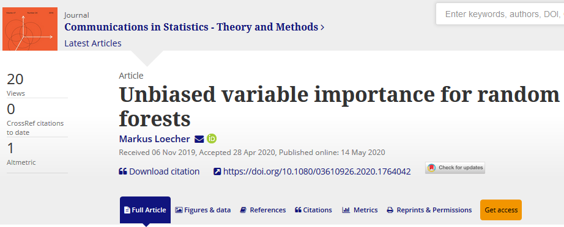

Supporting code for figures and results for the [paper](https://www.tandfonline.com/doi/full/10.1080/03610926.2020.1764042) 

# Abstract

The default variable-importance measure in random forests, Gini importance, has been shown to suffer from the bias of the underlying Gini-gain splitting criterion. While the alternative permutation importance is generally accepted as a reliable measure of variable importance, it is also computationally demanding and suffers from other shortcomings. We propose a simple solution to the misleading/untrustworthy Gini importance which can be viewed as an over-fitting problem: we compute the loss reduction on the out-of-bag instead of the in-bag training samples.
